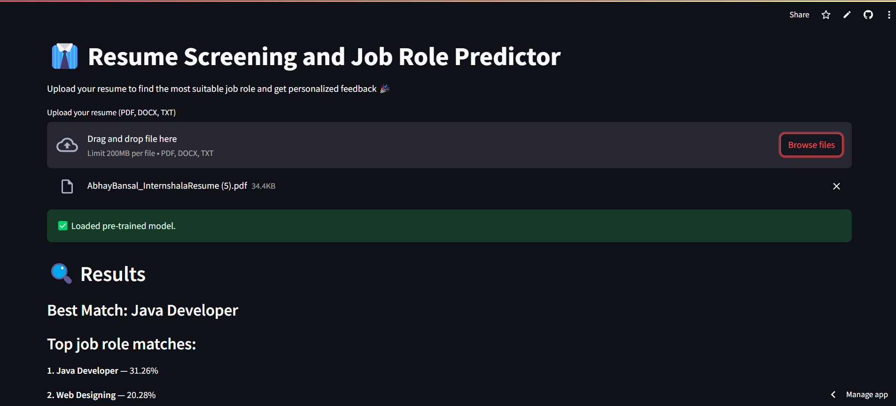
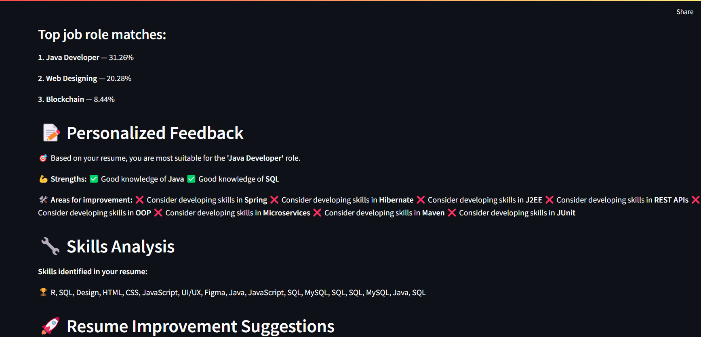
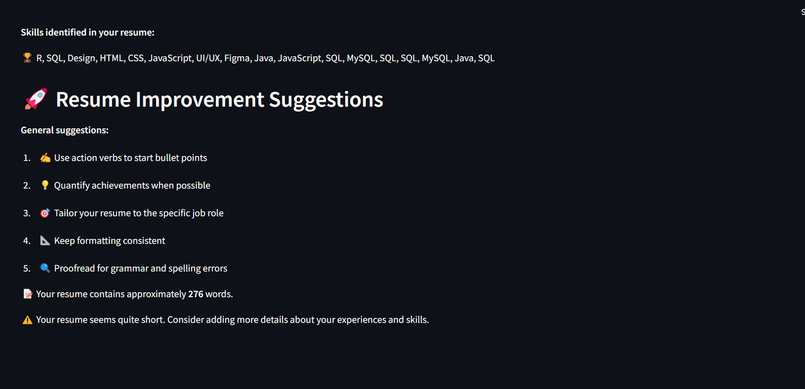

# 💼 Resume Screening and Job Role Predictor

A Streamlit web application that uses Natural Language Processing (NLP) and Machine Learning to:
- Analyze resumes (PDF/DOCX/TXT format)
- Predict the most suitable job role
- Provide personalized feedback based on required vs. present skills
- Suggest improvements for resume quality and content

---

## 🚀 Features

- 📂 Upload resumes in PDF, DOCX, or TXT format  
- 🧠 Intelligent job role prediction using a trained ML model  
- 💬 Personalized skill-based feedback  
- 🧰 Identifies skills present in your resume  
- 📝 Resume improvement tips  
- 📊 Top 3 matching job roles with confidence scores  

---

## 🛠️ Tech Stack

- **Python**
- **Streamlit**
- **Pandas, NumPy**
- **NLTK** for text preprocessing
- **Scikit-learn** for model training and prediction
- **TF-IDF Vectorizer** for feature extraction
- **PyPDF2, docx2txt** for resume parsing
- **Pickle** for model persistence

---

## 📁 Dataset

This app uses the [Updated Resume Dataset](https://www.kaggle.com/datasets/gauravduttakiit/resume-dataset) from Kaggle.  
> Make sure to download and place `UpdatedResumeDataSet.csv` in the root directory of the project.

---

## ⚙️ Setup Instructions

1. **Clone the Repository**
   ```bash
   git clone https://github.com/yodamynameis/resume-screening-app.git
   cd resume-screening-app
2. **Install Dependencies It is recommended to use a virtual environment.**
    ```bash
    pip install -r requirements.txt
    
3. **Download NLTK Resources (Optional)**
   ```python
   import nltk
   nltk.download('punkt')
   nltk.download('wordnet')
   nltk.download('stopwords')

4. **Run the App**
   ```bash
   streamlit run app.py


## 📦 Files Included

| File Name                  | Description                                         |
|---------------------------|-----------------------------------------------------|
| `app.py`                  | Main Streamlit application file                     |
| `UpdatedResumeDataSet.csv`| Resume dataset (to be downloaded from Kaggle)       |
| `resume_classifier_model.pkl` | Trained ML model (auto-generated if missing)     |
| `tfidf_vectorizer.pkl`    | TF-IDF vectorizer (auto-generated if missing)       |
| `label_encoder.pkl`       | Encoded labels (auto-generated if missing)          |
| `nltk_data/`              | NLTK downloads directory (optional)                 |
| `requirements.txt`        | Python package dependencies                         |

## 🧠 Model Details

- **Algorithm**: Multinomial Naive Bayes with One-vs-Rest strategy  
- **Input Features**: Preprocessed text from resumes  
- **Output**: Predicted job role category  

## ✨ Example Roles Predicted
- Data Scientist  
- Web Designer  
- Software Engineer  
- DevOps Engineer  
- HR  
- Advocate  
- Business Analyst  
- ...and 20+ more roles!

## 📷 Screenshot

Below are the sample screenshot of the Resume Screening App:




    
## 📌 Note

- If the **model/vectorizer/encoder** is not found, it will automatically train a new model.
- Make sure your resume text is **rich in relevant keywords and skills** for accurate predictions.

## 🤝 Contributions
Contributions, issues, and feature requests are welcome!
Feel free to fork the repo and submit a pull request.

## 👨‍💻 Author
Made with ❤️ by Anshul
